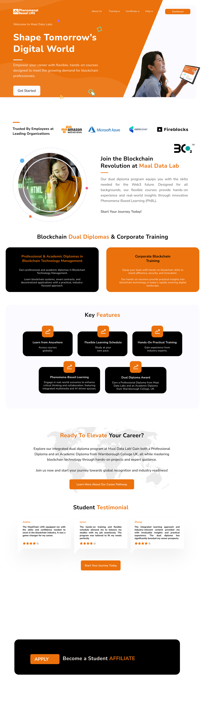

# MaalEdu - Blockchain Education Platform



A modern, responsive web platform for blockchain education powered by Next.js and featuring innovative Phenomena-Based Learning (PhBL) methodology.

## 🌟 Features

- **🎓 Dual Diploma Program**: Comprehensive blockchain education with dual certification
- **📱 Responsive Design**: Mobile-first approach with seamless cross-device experience
- **🌙 Dark/Light Theme**: Complete theme switching with system preference detection
- **⚡ Performance Optimized**: Built with Next.js 15 for optimal loading speeds
- **🎨 Modern UI/UX**: Clean interface using shadcn/ui and Tailwind CSS
- **🔧 Component-Based**: Modular architecture for easy maintenance and scalability
- **♿ Accessible**: WCAG compliant with proper ARIA attributes and keyboard navigation

## 🚀 Quick Start

### Prerequisites

- Node.js 18+ 
- pnpm (recommended) or npm
- Git

### Installation

1. **Clone the repository**
   ```bash
   git clone <repository-url>
   cd MAALEDU_FRONTEND
   ```

2. **Install dependencies**
   ```bash
   pnpm install
   ```

3. **Start development server**
   ```bash
   pnpm dev
   ```

4. **Open in browser**
   ```
   http://localhost:3000
   ```

### Available Scripts

```bash
pnpm dev          # Start development server
pnpm build        # Create production build
pnpm start        # Start production server
pnpm lint         # Run ESLint
```

## 🏗️ Project Structure

```
MAALEDU_FRONTEND/
├── app/                          # Next.js App Router
│   ├── globals.css              # Global styles
│   ├── layout.tsx               # Root layout
│   ├── page.tsx                 # Homepage
│   ├── about-us/                # About page
│   ├── career-pathway/          # Career pathways
│   ├── certification/           # Certification info
│   ├── contact-us/              # Contact page
│   ├── faqs/                    # FAQ page
│   └── policies/                # Legal pages
├── components/                   # React components
│   ├── ui/                      # shadcn/ui components
│   ├── site-header.tsx          # Navigation header
│   ├── site-footer.tsx          # Footer component
│   ├── hero-section.tsx         # Homepage hero
│   ├── trust-logos.tsx          # Partner logos
│   ├── testimonials.tsx         # Student testimonials
│   ├── dual-diplomas-section.tsx # Dual diploma info
│   ├── key-features.tsx         # Feature highlights
│   ├── program-overview.tsx     # Program details
│   ├── certification-preview.tsx # Certificate preview
│   ├── career-pathways-preview.tsx # Career paths
│   ├── blockchain-revolution-section.tsx # Revolution section
│   ├── cta-section.tsx          # Call-to-action
│   ├── affiliate-section.tsx    # Affiliate program
│   └── theme-provider.tsx       # Theme context
├── hooks/                       # Custom React hooks
├── lib/                         # Utility functions
├── public/                      # Static assets
│   └── assets/                  # Images and icons
└── styles/                      # Additional styles
```

## 🎨 Design System

### Color Palette
- **Primary**: Orange gradient (`orange-500` to `orange-700`)
- **Secondary**: Gray scale for text and backgrounds
- **Accent**: Orange variants for highlights and CTAs

### Typography
- **Font**: Geist (primary), system fonts (fallback)
- **Scales**: Responsive typography with mobile-first approach

### Components
Built with **shadcn/ui** components for consistency:
- Buttons, Cards, Dialogs
- Navigation, Dropdowns, Sheets
- Forms, Inputs, Selects
- Tabs, Accordions, Tooltips

## 🔧 Technology Stack

### Core Framework
- **Next.js 15.2.4** - React framework with App Router
- **React 19** - Latest React with concurrent features
- **TypeScript 5** - Type safety and developer experience

### Styling & UI
- **Tailwind CSS 4.1.9** - Utility-first CSS framework
- **shadcn/ui** - High-quality component library
- **Radix UI** - Accessible primitive components
- **Lucide React** - Beautiful icon library
- **next-themes** - Theme switching capability

### Development Tools
- **PostCSS** - CSS processing
- **ESLint** - Code linting
- **Prettier** (optional) - Code formatting

## 📄 Key Pages

### Homepage (`/`)
- Hero section with main value proposition
- Trust logos and accreditations
- Key features overview
- Dual diploma information
- Student testimonials
- Call-to-action sections

### About Us (`/about-us`)
- Company mission and vision
- Team information
- Educational philosophy

### Career Pathway (`/career-pathway`)
- Available career tracks
- Industry opportunities
- Success stories

### Certification (`/certification`)
- Certification details
- Recognition and accreditation
- Sample certificates

### Contact Us (`/contact-us`)
- Contact form
- Office locations
- Support information

## 🎯 Educational Focus

### Phenomena-Based Learning (PhBL)
- Real-world problem solving
- Hands-on blockchain projects
- Industry-relevant case studies

### Dual Certification Program
- **University Partner**: Accredited diploma
- **Industry Recognition**: Professional certification
- **Global Validity**: Internationally recognized credentials

### Target Audience
- Career changers seeking blockchain expertise
- Students interested in Web3 technologies
- Professionals upgrading their skills
- Entrepreneurs exploring blockchain applications

## 🌐 External Integrations

- **LMS Platform**: `https://lms.maaledu.com`
- **Partner Universities**: Warnborough University, UMS
- **Industry Partners**: Various blockchain organizations

## 🚀 Deployment

### Build Production
```bash
pnpm build
```

### Environment Setup
Create `.env.local` for environment-specific variables:
```env
NEXT_PUBLIC_LMS_URL=https://lms.maaledu.com
NEXT_PUBLIC_CONTACT_EMAIL=contact@maaledu.com
```

### Deployment Platforms
- **Vercel** (recommended for Next.js)
- **Netlify**
- **AWS Amplify**
- **Docker** containers

## 🔒 Performance & SEO

- **Core Web Vitals** optimized
- **Image optimization** with Next.js Image component
- **Meta tags** and structured data
- **Sitemap generation**
- **Mobile-first responsive design**

## 🤝 Contributing

1. Fork the repository
2. Create a feature branch (`git checkout -b feature/amazing-feature`)
3. Commit changes (`git commit -m 'Add amazing feature'`)
4. Push to branch (`git push origin feature/amazing-feature`)
5. Open a Pull Request

### Code Standards
- Use TypeScript for type safety
- Follow ESLint configuration
- Use meaningful component and variable names
- Write accessible HTML with proper ARIA attributes
- Optimize images and assets

## 📝 License

This project is proprietary and confidential. All rights reserved by MaalEdu.

## 📞 Support

- **Website**: [https://maaledu.com](https://maaledu.com)
- **LMS Platform**: [https://lms.maaledu.com](https://lms.maaledu.com)
- **Email**: contact@maaledu.com
- **Documentation**: Internal team documentation

## 🔮 Future Enhancements

- [ ] Student portal integration
- [ ] Payment gateway integration
- [ ] Multi-language support
- [ ] Advanced analytics dashboard
- [ ] Progressive Web App (PWA) features
- [ ] Live chat support
- [ ] Video testimonials
- [ ] Course preview functionality

---

**Built with ❤️ by the MaalEdu Team**

*Empowering the next generation of blockchain professionals through innovative education.*
